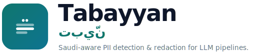

# Brand

The Tabayyan visual identity. The mark reads as **privacy before a single word**:
three lines of a document with the sensitive one masked to a solid bar — exactly
what Tabayyan does — and two scan dots that echo the two dots of the Arabic
letter **ت** (tāʾ) in *تبيّن*.

## Logo

The horizontal **lockup** is the primary logo.

| Asset | Use |
|---|---|
| [`tabayyan-lockup.svg`](assets/brand/tabayyan-lockup.svg) | primary logo — mark + wordmark + تبيّن + tagline |
| [`tabayyan-icon.svg`](assets/brand/tabayyan-icon.svg) | gradient app icon / favicon / app header |
| [`tabayyan-icon-ink.svg`](assets/brand/tabayyan-icon-ink.svg) | ink app icon for light chrome |
| [`tabayyan-glyph.svg`](assets/brand/tabayyan-glyph.svg) · [`…-white.svg`](assets/brand/tabayyan-glyph-white.svg) | tile-less glyph, transparent background |
| `assets/brand/png/tabayyan-icon-*.png` | raster icons / favicons (16–512) |

## Palette

| Token | Hex |
|---|---|
| Teal (gradient start) | `#0f766e` |
| Teal (gradient end) | `#0e7490` |
| Ink | `#0f172a` |
| Muted | `#64748b` |

The icon uses a top-left → bottom-right teal gradient (`#0f766e` → `#0e7490`).

## Type

- **Latin wordmark & UI:** Sora (weights 600 / 700 / 800), letter-spacing `-0.035em`.
- **Arabic:** Noto Kufi Arabic (700).
- **Code:** a monospace stack (`ui-monospace, SF Mono, Menlo, Consolas`).

The committed SVGs fall back to a system-sans stack so they render without web
fonts (e.g. on GitHub).

## Usage

- Keep clear space of at least **¼ of the icon width** around the mark.
- Don't recolor the gradient, stretch the lockup, or place the gradient icon on
  a busy background — use the ink icon on light chrome.

*Identity designed with [Claude Design](https://claude.ai/design).*
